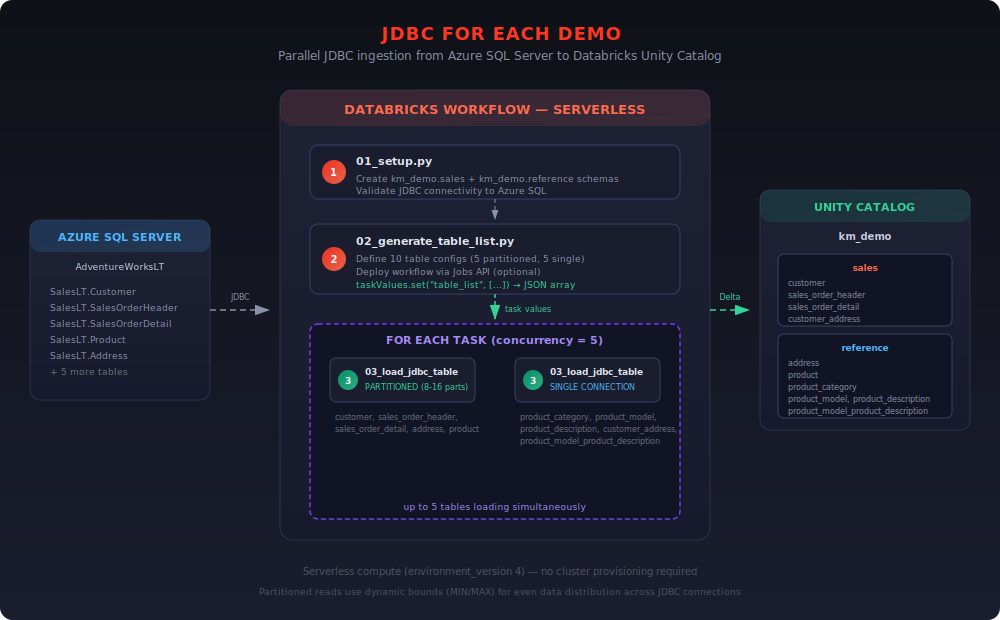

# JDBC For Each Demo

Parallel JDBC ingestion from Azure SQL Server into Databricks Unity Catalog using the **For Each** workflow task and **serverless compute**.

Loads 10 AdventureWorksLT tables (5 partitioned, 5 non-partitioned) in parallel with concurrency of 5 — no cluster provisioning required.

## Architecture



**Source:** Azure SQL Server (`AdventureWorksLT` sample database)
**Target:** Unity Catalog (`km_demo.sales` + `km_demo.reference`)
**Compute:** Serverless (environment version 4)

## Notebooks

| # | File | Purpose |
|---|------|---------|
| 1 | `01_setup.py` | Create Unity Catalog schemas, validate JDBC connectivity |
| 2 | `02_generate_table_list.py` | Define 10 table configs, optionally deploy the workflow |
| 3 | `03_load_jdbc_table.py` | Load a single table via JDBC (called by For Each task) |

## Tables Loaded

| Source Table | Target Table | Partitioned | Partitions |
|-------------|-------------|:-----------:|:----------:|
| SalesLT.Customer | km_demo.sales.customer | Yes | 8 |
| SalesLT.SalesOrderHeader | km_demo.sales.sales_order_header | Yes | 8 |
| SalesLT.SalesOrderDetail | km_demo.sales.sales_order_detail | Yes | 16 |
| SalesLT.Address | km_demo.reference.address | Yes | 8 |
| SalesLT.Product | km_demo.reference.product | Yes | 4 |
| SalesLT.ProductCategory | km_demo.reference.product_category | No | — |
| SalesLT.ProductModel | km_demo.reference.product_model | No | — |
| SalesLT.ProductDescription | km_demo.reference.product_description | No | — |
| SalesLT.ProductModelProductDescription | km_demo.reference.product_model_product_description | No | — |
| SalesLT.CustomerAddress | km_demo.sales.customer_address | No | — |

## Prerequisites

- Databricks workspace with Unity Catalog and serverless compute enabled
- Azure SQL Server with `AdventureWorksLT` sample database
- SQL login with `db_datareader` role on the database
- Databricks CLI configured with a profile (e.g., `pii-demo`)

## Steps to Replay

### 1. Upload notebooks to workspace

```bash
WORKSPACE_PATH="/Workspace/Users/<your-email>/whitecase"
PROFILE="pii-demo"

databricks workspace import "$WORKSPACE_PATH/setup" \
  --file 01_setup.py --language PYTHON --format SOURCE --overwrite --profile $PROFILE

databricks workspace import "$WORKSPACE_PATH/generate_table_list" \
  --file 02_generate_table_list.py --language PYTHON --format SOURCE --overwrite --profile $PROFILE

databricks workspace import "$WORKSPACE_PATH/load_jdbc_table" \
  --file 03_load_jdbc_table.py --language PYTHON --format SOURCE --overwrite --profile $PROFILE
```

### 2. Update connection details

Edit `01_setup.py` and `03_load_jdbc_table.py` with your SQL Server connection:

```python
JDBC_URL = "jdbc:sqlserver://<your-server>.database.windows.net:1433;database=AdventureWorksLT;encrypt=true;trustServerCertificate=false;loginTimeout=30;"
JDBC_USER = "<your-sql-user>"
JDBC_PASSWORD = "<your-password>"
```

Update the target catalog in `01_setup.py` and `02_generate_table_list.py` if using a different catalog.

### 3. Run setup notebook

```bash
databricks jobs submit --profile $PROFILE --no-wait --json '{
  "run_name": "setup-adventureworks",
  "tasks": [{
    "task_key": "setup",
    "notebook_task": {
      "notebook_path": "'"$WORKSPACE_PATH"'/setup"
    },
    "environment_key": "default"
  }],
  "environments": [{
    "environment_key": "default",
    "spec": {"client": "1"}
  }]
}'
```

**Expected output:** `setup_complete` — schemas created and JDBC connectivity validated.

### 4. Deploy the workflow

Run `02_generate_table_list` with `deploy_workflow=yes` to create the job:

```bash
databricks jobs submit --profile $PROFILE --no-wait --json '{
  "run_name": "deploy-workflow",
  "tasks": [{
    "task_key": "deploy",
    "notebook_task": {
      "notebook_path": "'"$WORKSPACE_PATH"'/generate_table_list",
      "base_parameters": {"deploy_workflow": "yes"}
    },
    "environment_key": "default"
  }],
  "environments": [{
    "environment_key": "default",
    "spec": {"client": "1"}
  }]
}'
```

**Or create the job directly via CLI:**

```bash
databricks jobs create --profile $PROFILE --json '{
  "name": "adventureworks_parallel_load",
  "tasks": [
    {
      "task_key": "generate_list",
      "notebook_task": {
        "notebook_path": "'"$WORKSPACE_PATH"'/generate_table_list"
      },
      "environment_key": "default"
    },
    {
      "task_key": "for_each_load",
      "depends_on": [{"task_key": "generate_list"}],
      "for_each_task": {
        "inputs": "{{tasks.generate_list.values.table_list}}",
        "concurrency": 5,
        "task": {
          "task_key": "load_table",
          "notebook_task": {
            "notebook_path": "'"$WORKSPACE_PATH"'/load_jdbc_table",
            "base_parameters": {
              "source_schema": "{{input.source_schema}}",
              "source_table": "{{input.source_table}}",
              "target_catalog": "{{input.target_catalog}}",
              "target_schema": "{{input.target_schema}}",
              "target_table": "{{input.target_table}}",
              "partition_column": "{{input.partition_column}}",
              "num_partitions": "{{input.num_partitions}}",
              "fetchsize": "{{input.fetchsize}}",
              "mode": "{{input.mode}}"
            }
          },
          "environment_key": "default"
        }
      }
    }
  ],
  "environments": [{
    "environment_key": "default",
    "spec": {"environment_version": "4"}
  }]
}'
```

### 5. Run the workflow

```bash
databricks jobs run-now <JOB_ID> --profile $PROFILE
```

Or from the Databricks UI: **Workflows** > `adventureworks_parallel_load` > **Run now**

### 6. Verify

```sql
SELECT count(*) FROM km_demo.sales.customer;
SELECT count(*) FROM km_demo.sales.sales_order_header;
SELECT count(*) FROM km_demo.reference.product;
```

## How It Works

### Workflow Structure

```
adventureworks_parallel_load
├── generate_list          → produces JSON array of 10 table configs via task values
└── for_each_load          → iterates over the array with concurrency=5
    └── load_table (x10)   → each iteration runs 03_load_jdbc_table with table params
```

### Partitioned vs Non-Partitioned Reads

**Partitioned tables** (Customer, SalesOrderHeader, SalesOrderDetail, Address, Product):
- Queries `MIN`/`MAX` of the partition column to compute dynamic bounds
- Opens multiple parallel JDBC connections (4-16 depending on table)
- Distributes rows evenly across Spark partitions

**Non-partitioned tables** (ProductCategory, ProductModel, etc.):
- Single JDBC connection per table
- Suitable for small lookup/reference tables

### Key Design Decisions

- **`dbutils.jobs.taskValues.set()`** passes the table list from task 1 to the For Each task (not `dbutils.notebook.exit()`)
- **Serverless compute** (`environment_version: 4`) eliminates cluster startup time
- **`for_each_task`** cannot have `environment_key` on the container task — only on the inner task
- **Dynamic bounds** prevent skew in partitioned reads by querying actual `MIN`/`MAX` values
